<properties
   pageTitle="Create a Hosted App | Cordova"
   description="description"
   services="na"
   documentationCenter=""
   authors="Mikejo5000"
   tags=""/>
<tags
   ms.service="na"
   ms.devlang="javascript"
   ms.topic="article"
   ms.tgt_pltfrm="mobile-multiple"
   ms.workload="na"
   ms.date="09/10/2015"
   ms.author="mikejo"/>

# Create a hosted app using Apache Cordova

Web developers can use Cordova to leverage existing web assets, get a web-based app uploaded to an app store, and get access to device features like the camera. In this topic, we want to show you a fast way to turn a Web site into a mobile app using Apache Cordova.

In general, when migrating a Web site, several approaches will work. Here are a few of them.

* Move your front end code (or your View) from your Web site to a new Cordova app.

    This can be a good option especially if your web site does not implement server-side technologies such as ASP.NET, PHP, and Ruby, which are not supported on Cordova. For this option, your front end code must be repackaged in a Cordova-friendly fashion (plain HTML5, CSS, and JavaScript, with JSON for communication with your back-end server) so that it can run in the Cordova client (the native WebView). For more info (and additional options), see [What's Next?](#next).

* Create a hosted app.

    For this scenario, you use a thin Cordova client (again, the native WebView) that automatically redirects to your Web site. For sites using ASP.NET and other server-side technologies, this is the fastest way to get up and running, and is a good way to get your app into one of the app stores quickly while learning Cordova. The full app experience will require an Internet connection, but you can also do a few things to handle offline scenarios. This approach will be much more effective if your Web site uses responsive design techniques.

    One advantage of using a hosted app is that you can make changes to the app on your server, and you only need to republish to the app store if you have changes to your device plugins.

Here is a quick look at the architecture of a hosted app showing an ASP.NET site on the left and the Cordova client app on the right. cordova.js gives access to the device APIs (Cordova plugins).

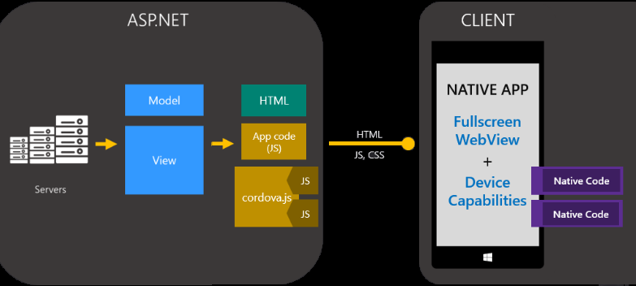

In this tutorial, we will get you started with Cordova by building a hosted app from an ASP.NET Web site.

## Get set up

1. If you haven't already, [Install Visual Studio 2015](http://go.microsoft.com/fwlink/?LinkID=533794) with Visual Studio Tools for Apache Cordova.

    > **Important**: When you install Visual Studio, make sure you include the optional components, **HTML/JavaScript (Apache Cordova)** under Cross-Platform Mobile Development.

2. Download the starter ASP.NET solution that we will use to create the hosted app.

    The starter solution is [here](https://github.com/Mikejo5000/CdvaHWA-starter). Download it and unzip. We will use this sample to show you how to create a hosted app.

    The complete sample is [here](https://github.com/ridomin/CdvaHWA). You can use that if you get stuck on anything.

3. Unzip the starter solution.

4. Open the starter solution (.sln file) in Visual Studio.

## Add a Cordova project to the solution

The starter solution includes an ASP.NET MVC site that we will use for the hosted app.

1. In Visual Studio's Solution Explorer, right-click the solution and choose **Add**, **New Project**.

    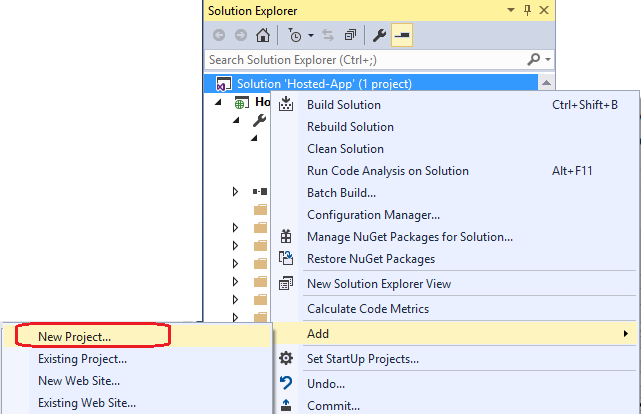

2. In the New Project dialog box, choose an Apache Cordova project, type a name like "CordovaHostedApp", and choose **OK**.

    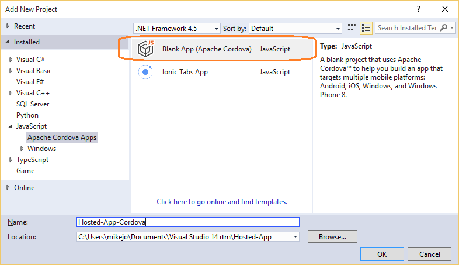

    Visual Studio creates the Cordova project as part of the same solution. The project appears in Solution Explorer.

3. In Solution Explorer, right-click the new Cordova project and choose **Set as Startup Project**.

4. At this point, make sure your Visual Studio 2015 setup is correct by running the default Blank App template that you just added to the solution.

     * Choose **Windows**, **Local Machine** as a deployment target and press F5 to run the app (make sure the app loads correctly).

     If you have Chrome installed, you can also run the app on Ripple (Choose **Android**, **Ripple - Nexus (Galaxy)** and press F5.

     When the app loads, it displays a "Hello" message.

     The app that loads at this point is a standard Cordova app running in a native WebView.

 5. Press Shift + F5 to stop debugging.

## Change the Cordova project to a hosted app

1. In Solution Explorer, right-click config.xml and choose **View Code**.

2. Add the following entry after the `<allow-intent.../>` tags.

    ```
    <allow-navigation href="https://cordovahostedweb-starter.azurewebsites.net" />
    ```

    This entry in config.xml will enable navigation to the hosted site.

    When you republish later, make sure the domain name you use in `<allow-navigation>` matches the published URL!

3. In Solution Explorer, right-click config.xml and choose **View Designer**.

4. In the Windows tab, choose Windows 10 in the **Windows Target Version**.

    The app will use this setting later when you run on Windows.

2. Open index.js in the www\scripts folder and replace all the default code with the following code.

    ```
    var app = {
        // Application Constructor
        initialize: function() {
        this.bindEvents();
        },
        bindEvents: function() {
            document.addEventListener('deviceready', this.onDeviceReady, false);
        },
        onDeviceReady: function() {
            app.receivedEvent('deviceready');

            // Here, we redirect to the web site.
            var targetUrl = "https://cordovahostedweb-starter.azurewebsites.net/";
            var bkpLink = document.getElementById("bkpLink");
            bkpLink.setAttribute("href", targetUrl);
            bkpLink.text = targetUrl;
            window.location.replace(targetUrl);
    },
        // Note: This code is taken from the Cordova CLI template.
        receivedEvent: function(id) {
            var parentElement = document.getElementById(id);
            var listeningElement = parentElement.querySelector('.listening');
            var receivedElement = parentElement.querySelector('.received');

            listeningElement.setAttribute('style', 'display:none;');
            receivedElement.setAttribute('style', 'display:block;');

            console.log('Received Event: ' + id);
        }
    };

    app.initialize();
    ```
    The preceding code sets the URL of the native WebView window (using window.location.replace) when Cordova's deviceReady event fires. In the deviceReady handler, we set the URL to the web site URL.

    Most of the remaining code here is from the Cordova CLI blank template, and you don't need to worry about it right now.

3. Open index.html and replace all the HTML in the `<body>` element with the following HTML.

    ```
    Verifying connectivity..
    <a id="bkpLink" href="https://cordovahostedweb-starter.azurewebsites.net">
        cordovahostedweb.azurewebsites.net</a>

    <div class="app">
        <h1>Apache Cordova</h1>
        <div id="deviceready" class="blink">
            <p class="event listening">Connecting to Device</p>
            <p class="event received">Device is Ready</p>
        </div>
    </div>
    <script type="text/javascript" src="cordova.js"></script>
    <script type="text/javascript" src="scripts/index.js"></script>
    ```

    The most important thing here is that you create the anchor link that is used in the redirect script we created in the previous step.

4. In index.html, replace the Content-Security-Policy (CSP) <meta> element with the following <meta> element.

    ```
    <meta http-equiv="Content-Security-Policy" content="default-src 'self' data: gap:
    https://cordovahostedweb-starter.azurewebsites.net https://ssl.gstatic.com
     'unsafe-eval'; style-src 'self' 'unsafe-inline'; media-src *">
    ```

    By adding the web site URL to the above CSP (https://cordovahostedweb-starter.azurewebsites.net in this example), you specify that it is a trusted domain, and content from this site will be allowed in your hosted app.

5. Optionally, add additional <meta> elements that are included in the default Cordova CLI template.

    ```
    <meta name="format-detection" content="telephone=no">
    <meta name="msapplication-tap-highlight" content="no">
    <meta name="viewport" content="user-scalable=no, initial-scale=1,
      maximum-scale=1, minimum-scale=1, width=device-width">
    ```

7. Now, choose to deploy to **Android**, and pick an emulator like the **VS Emulator 5" KitKat(4.4) XXHDPI Phone**.

    > **Note**: This emulator [requires Hyper-V](https://msdn.microsoft.com/en-us/library/mt228280.aspx). If you don't have Hyper-V enabled, choose **Ripple - Nexus (Galaxy)** instead.

    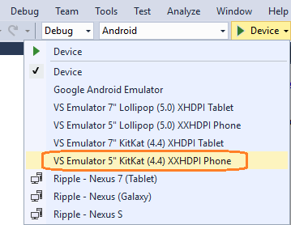

8. Press F5 to start the app.

    When the emulator starts, you will see the hosted app load in the emulator!

    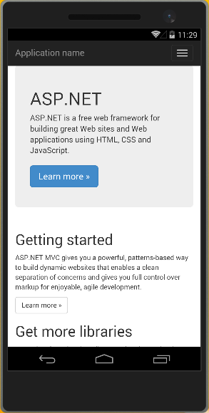

    If everything looks good, you already have your hosted app working! However, we need to do a few more things to enable support for device plugins.

8. Now, choose to deploy to **Windows - Any CPU**, and pick **Local Machine**.

9. Press F5 to start the app on Windows.

    Here is what the hosted app looks like on a Windows device.

    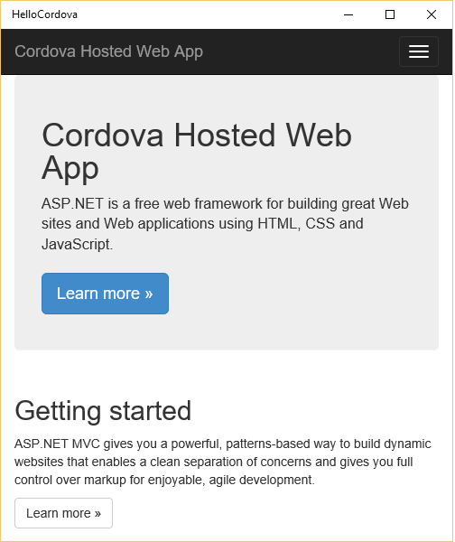

## Provide a mobile-specific page for the web site

Now, you will update the web site to display a mobile-specific page if the site detects a Cordova app. In this app, you will add this code so that users running the Cordova hosted app can access device features such as the camera, while visitors using a browser will get the default home page.

1. In index.js in the Cordova project, update the targetUrl variable.

    This line of code should look like this now.

    ```
    var targetUrl = "https://cordovahostedweb-redirect.azurewebsites.net/cordova/setPlatformCookie?platform="
     + cordova.platformId;
    ```

    Now, when the Cordova app redirects to the web site, we call a function (setPlatformCookie) to tell the web site that a Cordova app is running. We also pass in the Cordova platform ID. We will need this for redirection.

    > **Note**: To save steps later, we’re using a new URL: https://cordovahostedweb-redirect.azurewebsites.net

1. In the ASP.NET project, right-click the Controllers folder and choose **Add**, **Existing item**, go to the Controllers folder, and add the file called cordovaController.cs to the project.

    This file contains the following code.

    ```
    using System;
    using System.Collections.Generic;
    using System.Linq;
    using System.Web;
    using System.Web.Mvc;

    namespace CordovaHostedWeb.Controllers
    {
        public class CordovaController : Controller
        {
            const string platformCookieKey = "cdva_platfrm";
            public ActionResult Index()
            {
                var cookie = HttpContext.Request.Cookies[platformCookieKey];
                var platform = "dontknow";
                if (cookie!=null)
                {
                    platform = cookie.Value;
                }
                ViewBag.Platform = platform;
                return View();
            }
            public ActionResult setPlatformCookie(string platform)
            {
                if (!string.IsNullOrWhiteSpace(platform))
                {
                    HttpContext.Response.SetCookie(new HttpCookie(
                      platformCookieKey, platform));
                }
                return RedirectToAction("index");
            }
        }
    }
    ```

    This code redirects the site to the Cordova-specific Index.cshtml when the client app passes a querystring that includes the setPlatformCookie function call along with the platform ID. We already specified this URL in the client app's redirect script (index.js).

5. In the ASP.NET project, right-click the Views/Cordova folder and choose **Add**, **Existing item**, go to the Views/Cordova folder, and add the file called Index.cshtml to the project.

    This page contains the following code.

    ```    
    @{
        ViewBag.Title = "index";
        var platform = ViewBag.Platform;
    }

    <h2>index</h2>

    @section Metas{
        <meta http-equiv="Content-Security-Policy" content="default-src 'self' data: gap:
        https://cordovahostedweb-redirect.azurewebsites.net/ https://ssl.gstatic.com
        'unsafe-eval'; style-src 'self' 'unsafe-inline'; media-src *">
    }

    @if (platform == "android" || platform == "ios" || platform == "windows")
    {
        @Scripts.Render("~/cordovadist/" + platform + "/cordova.js");

        <p><a class="btn btn-primary btn-lg">Learn more &raquo;</a></p>
        

        @Scripts.Render("~/cordovaApp/app.js");
    }
    else
    {
        <p>Not valida platform found</p>
    }

    <div>
        Found cookie platform to be: <strong>@platform</strong>
    </div>
    ```

    This page is a mobile-specific page that renders when a Cordova app connects with a valid platform ID (Android, iOS, or Windows). This code includes the same CSP <meta> element as the client app, which means the client app can show content from the web site.

    This page also loads a platform-specific version of cordova.js, which enables the use of Cordova plugins for device access. When we finish these steps, your app will be able to access device features on Android, iOS, and Windows. We will use device features (Camera) later in this tutorial.

    Finally, this page also loads the app.js script. We will use this file later to add the Camera plugin code. (You don't need to worry about that yet.)

## Fix up styling in the intitial page

* In index.css in the Cordova project, replace the CSS code with this:

```
* {
    -webkit-tap-highlight-color: rgba(0,0,0,0); /* make transparent link selection, adjust last value opacity 0 to 1.0 */
}

body {
    -webkit-touch-callout: none;                /* prevent callout to copy image, etc when tap to hold */
    -webkit-text-size-adjust: none;             /* prevent webkit from resizing text to fit */
    -webkit-user-select: none;                  /* prevent copy paste, to allow, change 'none' to 'text' */
    background-color:#E4E4E4;
    background-image:linear-gradient(top, #A7A7A7 0%, #E4E4E4 51%);
    background-image:-webkit-linear-gradient(top, #A7A7A7 0%, #E4E4E4 51%);
    background-image:-ms-linear-gradient(top, #A7A7A7 0%, #E4E4E4 51%);
    background-image:-webkit-gradient(
        linear,
        left top,
        left bottom,
        color-stop(0, #A7A7A7),
        color-stop(0.51, #E4E4E4)
    );
    background-attachment:fixed;
    font-family:'HelveticaNeue-Light', 'HelveticaNeue', Helvetica, Arial, sans-serif;
    font-size:12px;
    height:100%;
    margin:0px;
    padding:0px;
    text-transform:uppercase;
    width:100%;
}

/* Portrait layout (default) */
.app {
    background:url(../img/logo.png) no-repeat center top; /* 170px x 200px */
    position:absolute;             /* position in the center of the screen */
    left:50%;
    top:50%;
    height:50px;                   /* text area height */
    width:225px;                   /* text area width */
    text-align:center;
    padding:180px 0px 0px 0px;     /* image height is 200px (bottom 20px are overlapped with text) */
    margin:-115px 0px 0px -112px;  /* offset vertical: half of image height and text area height */
                                   /* offset horizontal: half of text area width */
}

/* Landscape layout (with min-width) */
@media screen and (min-aspect-ratio: 1/1) and (min-width:400px) {
    .app {
        background-position:left center;
        padding:75px 0px 75px 170px;  /* padding-top + padding-bottom + text area = image height */
        margin:-90px 0px 0px -198px;  /* offset vertical: half of image height */
                                      /* offset horizontal: half of image width and text area width */
    }
}

h1 {
    font-size:24px;
    font-weight:normal;
    margin:0px;
    overflow:visible;
    padding:0px;
    text-align:center;
}

.event {
    border-radius:4px;
    -webkit-border-radius:4px;
    color:#FFFFFF;
    font-size:12px;
    margin:0px 30px;
    padding:2px 0px;
}

.event.listening {
    background-color:#333333;
    display:block;
}

.event.received {
    background-color:#4B946A;
    display:none;
}

@keyframes fade {
    from { opacity: 1.0; }
    50% { opacity: 0.4; }
    to { opacity: 1.0; }
}

@-webkit-keyframes fade {
    from { opacity: 1.0; }
    50% { opacity: 0.4; }
    to { opacity: 1.0; }
}

.blink {
    animation:fade 3000ms infinite;
    -webkit-animation:fade 3000ms infinite;
}
```

## Connect to the hosted app from your device.

To save time and steps, instead of republishing the ASP.NET project to a new Azure Web App URL, we will connect to a version of the project with the changes already in place. (If you want info on how to republish to a new URL, see the Appendix in this article.)

1. Update the URL references in the ASP.NET project and in your Cordova app to point to the new site. Specifically, update these references:

    In the Cordova project:
    * In config.xml, update the `<allow-navigation>` element with the new URL:
        https://cordovahostedweb-redirect.azurewebsites.net/
    * In index.html, update the CSP `<meta>` element with the same URL.
    * In index.js, we already modified the targetURL variable with the new URL, so you don’t need to change it.

    In the ASP.NET project:
    * In Views/Cordova/index.cshtml, we already modified the CSP `<meta>` element with the new URL, so you don’t need to change it.

2. In index.js, verify that you are using the correct value for the targetUrl. It should look like this:

    ```
    var targetUrl = "https://cordovahostedweb-redirect.azurewebsites.net/cordova/setPlatformCookie?platform="
     + cordova.platformId;
    ```

4. Press F5.

    This time, when the hosted app loads on your device, the Cordova-specific page will load.

    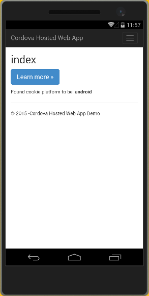

    However, we want to fix up this page so that you can access the device camera and take a picture.

## Add plugins to your project

Cordova plugins will give you device access to things like the camera and file system. In this tutorial, we are using the Camera plugin. The exact same methods apply to using other plugins in a hosted app.

1. In Solution Explorer, open config.xml and choose the Plugins tab.

2. Select the **Camera** plugin and choose **Add**.

    Visual Studio adds this plugin to your solution. We will use this plugin later when adding device capabilities.

3. Select the **Whitelist** plugin and choose **Add**.

    The plugin is already present in the Blank App template, but we want the Visual Studio configuration designer to see it.

## Take a quick look at the plugin files in the ASP.NET project.

For the web site to run plugin code, the plugin code needs to be copied from the Cordova project to the web site. To save steps in this tutorial, we already copied the plugin files from the Cordova project to the ASP.NET project. Take a look at the files under the Cordova folder.

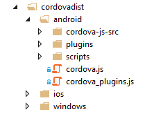

You can find these files in the \platforms folder after building your Cordova project for a particular platform like Android. For example, the Android files are in \platforms\android\assets\www.

The ASP.NET project uses ImportCordovaAssets.proj to automatically copy these files from the Cordova project into the ASP.NET project. You can use the .proj file in your own hosted app, but we won't be looking at it now.

## Configure the Web site to run the Camera plugin code

The starter ASP.NET project already has the plugin code. Now, we can add some code to actually use the Camera app on the device.

1. In your ASP.NET project, open Views/Cordova/Index.cshtml.

2. Find the `btn-lrg` <anchor> element and change the display text to **Take Picture**.

    When updated, this line of HTML should look like this:

    `<p><a class="btn btn-primary btn-lg">Take Picture &raquo;</a></p>`

3. Open app.ts and add an event handler for the button's click event in the onDeviceReady function.

    The updated function looks like this:

    ```
    function onDeviceReady() {
        // Handle the Cordova pause and resume events
        document.addEventListener('pause', onPause, false);
        document.addEventListener('resume', onResume, false);

        document.getElementsByClassName('btn-lg')[0].addEventListener('click', takePicture);

    }
    ```

4. In app.ts, add the following function in the same scope as the onDeviceReady function (make it one of the Application module exports).

    ```
    function takePicture() {
        if (!navigator.camera) {
            alert("Camera API not supported");
            return;
        }
        var options = {
            quality: 20,
            destinationType: Camera.DestinationType.DATA_URL,
            sourceType: 1,      
            encodingType: 0     
        };

        navigator.camera.getPicture(
            function (imgData) {
                var el : HTMLElement;
                el = <HTMLElement>document.getElementsByClassName('media-object')[0];
                var srcAttr = document.createAttribute("src");
                srcAttr.value = "data:image/jpeg;base64," + imgData;
                el.attributes.setNamedItem(srcAttr);                    
            },
            function () {
                alert('Error taking picture');
            },
            options);

        return false;
    }
    ```

    This code adds an event handler for the **Take Picture** picture button that you just modified in Index.cshtml. When you press the button, the app calls takePicture, which will run the Camera app using the Camera plugin.

## Connect to the hosted app with the working Camera code from your device

To save time and steps, instead of republishing the ASP.NET project to a new Azure Web App URL, we will connect to the final version of the project with Camera support already in place. (If you want info on how to republish to a new URL, see the Appendix in this article.)

1. Update the URL references in the ASP.NET project and in your Cordova app to point to the new site. Specifically, update these references:

    In the Cordova project:
    * In config.xml, update the `<allow-navigation>` element with the new URL:
        https://cordovahostedweb.azurewebsites.net/
    * In index.html, update the CSP `<meta>` element with the same URL.
    * In index.js, update the targetURL variable with the new URL.

    In the ASP.NET project:
    * In Views/Cordova/index.cshtml, update the CSP <meta> element with the new URL.

2. In index.js, verify that you are using the correct value for the targetUrl. It should look like this:

    ```
    var targetUrl = "https://cordovahostedweb.azurewebsites.net/cordova/setPlatformCookie?platform=" + cordova.platformId;
    ```

6. Choose a depoyment target like **Windows**, **Local Machine**.

    If you already have Hyper-V working, you can instead choose **Android**, **VS Emulator 5" KitKat(4.4) XXHDPI Phone**.

    > **Note**: Ripple doesn't support the Camera plugin, so you can't run successfully on Ripple at this point.

6. Press F5 to run the app.

7. When the app loads, press the **Take Picture** button.

    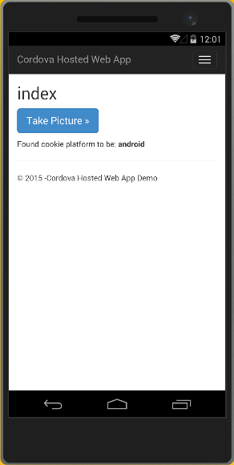

    When you press the button, the Camera app loads in the hosted web app.

    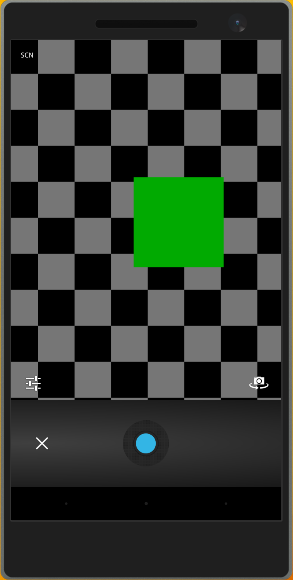

    You can click the round button at the bottom to take a picture on the device (Android shown).

## What's Next? <a id="next" />

You will likely need to investigate options to find an approach that works best for you. A hosted app can help you get an app into the app store quickly, but you may decide to go another route as well. Here are some options for moving forward.

* **Make your Hosted App Better**

    * Add splash screens and icons. Take a look at the cordova-imaging plugin for this.

    * Make you Web site more responsive. You can build native-like features into your Web UI such as pull-to-refresh, or use frameworks such as Ionic.

    * Get real offline support:
        * For caching pages, implement a service worker or use AppCache. With AppCache, it can be a challenge to debug the required manifest.
        * For offline data, use IndexedDB or WebSQL (the latter is a deprecated standard).

    * Take a look at [Manifold.js](http://manifoldjs.com/). You give it a Web site URL, and it gives you a hosted mobile app. (Note that the resulting project is not compatible with the Cordova CLI, nor with dependent tools like Visual Studio Tools for Apache Cordova.)

* **Create a Cordova app by refactoring the front end code on your Web site**

    * In a Cordova project, use plain HTML5, CSS, and JavaScript for your UI, along with xhr requests and JSON for calling your back-end. You may also choose to improve your app by using a mobile-optimized JavaScript framework such as Ionic or bootstrap. Or you can use a framework like JQuery.

    * If your Web site doesn't use dynamically generated HTML, you may be able to take this approach to get up and running fairly quickly.

* **Create a fully packaged app by migrating your Web site to Cordova**

    * Similar to the refactoring option, but you move the entire site to Cordova as a fully packaged app. If you call a web service in your app, use xhr and JSON. Doing this work may or may not be easy depending on whether your site used a lot of server-side technologies.

## Appendix: Publish the Web site

You can publish the ASP.NET project to a new URL, and use that URL for your hosted app instead of the pre-existing Azure Web App URLs that are referenced in this tutorial.

1. Choose **Build**, then **Build Solution**.

2. In Solution Explorer, right-click the ASP.NET project (CordovaHostedWeb) and choose **Publish**.

    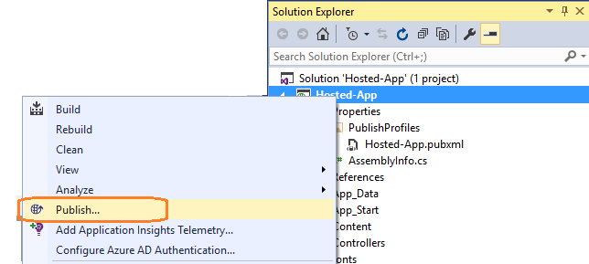

3. In the Publish Web dialog box, choose **Microsoft Azure Web Apps**.

    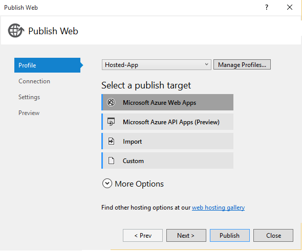

    Visual Studio opens the Azure Web App Settings page. For this tutorial, the Azure settings aren't important, but by completing the dialog box, we can use the **Publish** feature in VS for Web sites.

5. In the Configure Microsoft Azure Web App dialog box, enter your Microsoft Account credentials if you are asked for them.

    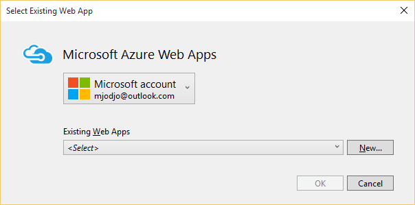

6. Click **New**.

    You will use new settings for the web site because that way we can make updates to the site and publish to a new URL.

    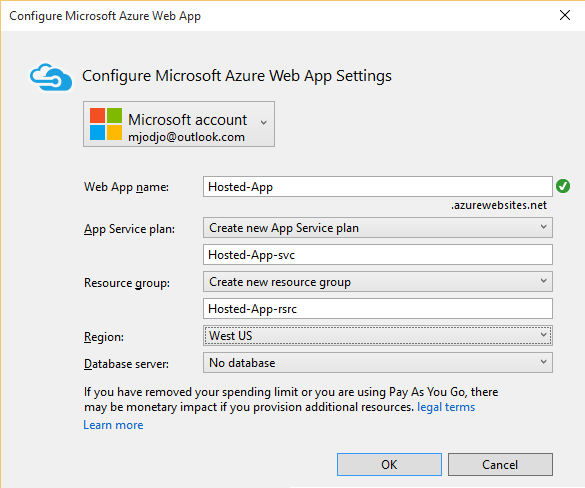

    Use unique values like **Hosted-App-yourusername** and **Hosted-App-svc-yourusername**.

    When you click OK, Visual Studio creates the solution and the new Web App. (Don't worry about any Azure error messages at this point...)

5. In the Publish Web dialog box, change the URL to https:// from http://.

    The change to SSL is for iOS support (which we won't test right now).

4. In the Publish Web dialog box, copy the **Destination URL** to the clipboard, and then choose **Publish**.

    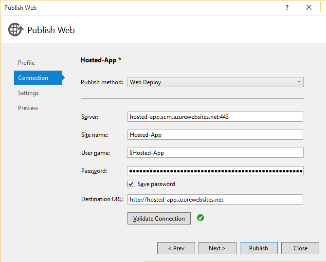

    The ASP.NET MVC web site will open in your browser.

    Now, you need to update your app with the new URL.
